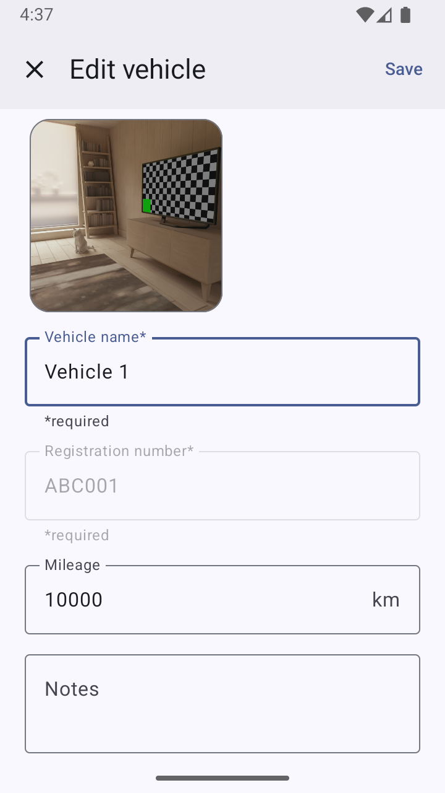

# GarageLog

## Introduction

**GarageLog** helps you effortlessly keep track of all your vehicles in one
place. Record service history, add important notes, and set reminders for upcoming
maintenance or other events. Whether you're an enthusiast or just want to keep
up with regular maintenance, GarageLog makes it easy to keep every vehicle in
top condition.

## Features

- 🧰 Track service history  
- ⏰ Set and manage reminders  
- 🔒 100% local storage — your data never leaves your device  
- 🎨 Material Design interface  
- 🌙 Automatically adapts to system dark/light mode  

## Installation

Download the latest APK from the
[Releases](https://github.com/jonwin1/GarageLog/releases) page and install it on
your Android device.

## Screenshots

| Main Page | Vehicle Page | Edit Vehicle |
|------------|---------------|---------------|
|  |  |  |

| Reminders | Edit Reminder |
|-----------|---------------|
|  |  |

| Service History | New Service |
|-----------------|-------------|
|  |  |

## TODO

- Better images  
- Add notifications for reminders  
- Support multiple images per vehicle  
- Import, export, and print vehicle data  

## About

GarageLog was originally developed as part of a university summer course in
Android application development. The assignment was to design and build a fully
functional Android app of our choice, demonstrating the concepts learned
throughout the course.

A detailed project report (in Swedish) can be found
[here](https://github.com/jonwin1/GarageLog/rapport.pdf). It covers the app’s
features, architecture, and design decisions in depth.
